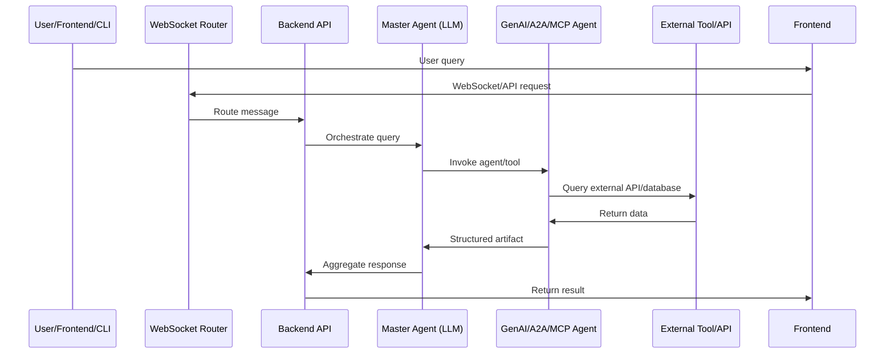

# 🧬 LIVE! Agentic Database💻🧪
Longivity Interventions Verified Evidence Database
 
# By Longevity PRO Hackers (LPH)
Ishika Tawer, 
Juan Martinez Pomares,
J.P Medved


This repository contains the development of an agentic AI system designed to understand diferents Longevity Interventions. This work is the implementation for [Hackaging](https://www.hackaging.ai/) Hackathon and is built upon the GenAI-AgentOS framework and hacklab-bio (forked from [genai-works-org/genai-agentos](https://github.com/genai-works-org/genai-agentos)).
# Overview

This repository implements a modular, agentic AI system for longevity intervention research, built for the Hackaging Hackathon. It is based on the GenAI-AgentOS framework and integrates multiple agent types, orchestration modules, and biomedical tools. The system enables:

- Automated literature surveillance
- [Search on Longevity Intervention Verified Evidence (LIVE Database)](https://database.longevityadvice.com/)
- Hypothesis synthesis
- Suggentions about perzonalized interventions

Agents interact via GenAI Protocol, A2A, and MCP standards, supporting both LLM-driven and tool-based workflows.

## Objective

Create and adapt intelligent agents to help users understand longevity interventions based on scientific evidence.

## Features

- Modular multi-agent architecture (CrewAI, GenAI Protocol, A2A, MCP)
- Integration with scientific databases and external APIs (PubMed, KEGG, Reactome, Google Scholar)
- Customizable workflows for cellular longevity and biomedical studies
- Extensible framework for new agent/tool development
- Docker and CLI support for easy deployment and management

## Repository Structure

- `backend/`: FastAPI backend, REST & WebSocket API, agent orchestration
- `frontend/`: React/Vite/TypeScript UI for agent interaction
- `master-agent/`: LLM-powered supervisor agent (ReAct, LangGraph)
- `router/`: WebSocket server for agent registration and message routing
- `cli/`: Command-line interface for agent/user management
- `crewai-a2a-server/`: CrewAI-based biomedical multi-agent system (A2A protocol)
- `live-a2a-server/`: [LIVE! Agents for live/judge biomedical queries](https://github.com/MPomaresJF/live-agentic-database/blob/main/live-a2a-server/README.md)
- `tests/`: Pytest-based test suite

## Architecture
Reusing cdebase and plug and play 


Keep interoperability


Deploy everywhere




## Example Use Cases

- Literature search and synthesis (PubMed, arXiv, Google Scholar)
- Genomic data extraction and pathway mapping
- Intervention analysis and evidence review
- Hypothesis generation from multi-agent artifacts

## Supported Agent Types

| Agent Type       | Description                                                                                   |
|------------------|-----------------------------------------------------------------------------------------------|
| **GenAI Agents** | Connected via [`genai-protocol`](https://pypi.org/project/genai-protocol/) library interface. |
| **MCP Servers**  | MCP (Model Context Protocol) servers can be added by pasting their URL in the UI.             |
| **A2A Servers**  | A2A (Agent to Agent Protocol) servers can be added by pasting their URL in the UI.            |

## Project Setup

### Prerequisites

- [Docker](https://www.docker.com/)
- [Docker Compose](https://docs.docker.com/compose/)
- [`make`](https://www.gnu.org/software/make/) (optional)
- [Node.js](https://nodejs.org/en/download/) (for frontend)
- [uv](https://docs.astral.sh/uv/) or pip (for Python agents)

### Environment Variables

Create a `.env` file in the root directory. See `.env-example` for available variables. Key variables include:

- `FRONTEND_PORT`, `ROUTER_WS_URL`, `SECRET_KEY`, `POSTGRES_*`, `MASTER_AGENT_API_KEY`, `BACKEND_CORS_ORIGINS`, etc.

### Local Setup

1. Clone the repository:
   ```bash
   git clone https://github.com/MPomaresJF/live-agentic-database
   cd hacklab-bio/
   ```
2. Create a `.env` file:
   ```bash
   cp .env-example .env
   ```
3. Start Docker desktop and ensure it is running.
4. Start the infrastructure:
   ```bash
   make up
   # or
   docker compose up
   ```
5. Access services:
   - Frontend UI: [http://localhost:3000/](http://localhost:3000/)
   - Swagger API Docs: [http://localhost:8000/docs#/](http://localhost:8000/docs#/)

### Frontend

1. Install dependencies:
   ```bash
   npm install
   ```
2. Start development server:
   ```bash
   npm run dev
   ```
   App available at [http://localhost:3000](http://localhost:3000)

### Backend

1. Install Python 3.12 and `uv` (see backend/README.md for details)
2. Install dependencies:
   ```powershell
   uv venv
   uv sync
   .venv\Scripts\Activate.ps1
   uv run main.py
   ```
3. Ensure Postgres is running and migrations are applied:
   ```powershell
   alembic upgrade head
   ```

### CLI

1. Install or build CLI (see cli/README.md)
2. Register/login users and agents:
   ```powershell
   python cli.py signup -u <username>
   python cli.py login -u <username> -p <password>
   python cli.py register_agent --name <agent_name> --description <desc>
   ```

### CrewAI A2A Servers

See `crewai-a2a-server/README.md` and `live-a2a-server/README.md` for agent details and Docker usage.

## Troubleshooting

- If MCP/A2A servers are not accessible, use `host.docker.internal` instead of `localhost` in URLs.
- Ensure all environment variables are set and Docker containers are running.
- Clean up Docker assets if issues persist (remove containers, images, volumes).

## References

- [GenAI-AgentOS](https://github.com/genai-works-org/genai-agentos)
- [CrewAI Documentation](https://docs.crewai.com/introduction)
- [A2A Protocol](https://a2a-protocol.org)
- [KEGG API](https://www.kegg.jp/kegg/rest/keggapi.html)
- [Reactome API](https://reactome.org/ContentService/)
- [Google Gemini API](https://ai.google.dev/gemini-api)

## License

[MIT](LICENSE)
# 🐍 GenAI Agents Infrastructure

This repository provides the complete infrastructure for running GenAI agents, including:

* Backend
* Router
* Master Agents
* PostgreSQL Database
* Frontend
* CLI
* Redis
* Celery

## 📎 Repository Link

👉 [GitHub Repository](https://github.com/genai-works-org/genai-agentos)

## 🛠️ Readme Files

* [CLI](cli/README.md)
* [Backend](backend/README.md)
* [Master Agents](master-agent/README.md)
* [Router](router/README.md)
* [Frontend](frontend/README.md)

## 📄️ License
* [MIT](LICENSE)


## 🧠 Supported Agent Types

The system supports multiple kinds of Agents:

| Agent Type       | Description                                                                                   |
|------------------|-----------------------------------------------------------------------------------------------|
| **GenAI Agents** | Connected via [`genai-protocol`](https://pypi.org/project/genai-protocol/) library interface. |
| **MCP Servers**  | MCP (Model Context Protocol) servers can be added by pasting their URL in the UI.             |
| **A2A Servers**  | A2A (Agent to Agent Protocol) servers can be added by pasting their URL in the UI.            |

---

## 📦 Prerequisites

Make sure you have the following installed:

* [Docker](https://www.docker.com/)
* [Docker Compose](https://docs.docker.com/compose/)
* [`make`](https://www.gnu.org/software/make/) (optional)

  * macOS: `brew install make`
  * Linux: `sudo apt-get install make`

## 🚀 Local Setup

1. Clone the repository:

   ```bash
   git clone https://github.com/palmedicoai/hacklab-bio.git
   cd hacklab-bio/
   ```

2. Create a `.env` file by copying the example (can be empty and customized later):

   ```bash
   cp .env-example .env
   ```

   * A `.env` file **should be present** for configuration.
   * All variables in `.env-example` are commented. 
     Platform starts with an empty `.env` file.
     You can customize any environment setting by **uncommenting** the relevant line and providing a new value.

3. Start Docker desktop and ensure it is running.

4. Start the infrastructure:

   ```bash
   make up
   # or alternatively
   docker compose up
   ```

5. After startup:

   * Frontend UI: [http://localhost:3000/](http://localhost:3000/)
   * Swagger API Docs: [http://localhost:8000/docs#/](http://localhost:8000/docs#/)

## 👾 Supported Providers and Models
* OpenAI: gpt-4o

## 🌐 Ngrok Setup (Optional)

Ngrok can be used to expose the local WebSocket endpoint.

1. Install Ngrok:

   * macOS (Homebrew): `brew install ngrok/ngrok/ngrok`
   * Linux: `sudo snap install ngrok`

2. Authenticate Ngrok:

   * Sign up or log in at [ngrok dashboard](https://dashboard.ngrok.com).
   * Go to the **"Your Authtoken"** section and copy the token.
   * Run the command:

     ```bash
     ngrok config add-authtoken <YOUR_AUTH_TOKEN>
     ```

3. Start a tunnel to local port 8080:

   ```bash
   ngrok http 8080
   ```

4. Copy the generated WebSocket URL and update the `ws_url` field in:

   ```
   genai_session.session.GenAISession
   ```

---

## 🤖GenAI Agent registration quick start (For more data check [CLI](cli/README.md))
```bash
cd cli/

python cli.py signup -u <username> # Register a new user, also available in [UI](http://localhost:3000/)

python cli.py login -u <username> -p <password> # Login to the system, get JWT user token

python cli.py register_agent --name <agent_name> --description <agent_description>

cd agents/

# Run the agent
uv run python <agent_name>.py # or alternatively 
python <agent_name>.py 
```

## 💎 Environment Variables

| Variable                    | Description                                                          | Example / Default                                                                       |
|-----------------------------|----------------------------------------------------------------------|-----------------------------------------------------------------------------------------|
| `FRONTEND_PORT`             | Port to start a frontend                                             | `3000` - default. Can be changed by run in terminal ` source FRONTEND_PORT=<your_port>` |
| `ROUTER_WS_URL`             | WebSocket URL for the `router` container                             | `ws://genai-router:8080/ws` - host is either `localhost` or `router` container name     |
| `SECRET_KEY`                | Secret key for cryptographic operations - JWT/ LLM config encryption | `$(openssl rand -hex 32)`                                                               |
| `POSTGRES_HOST`             | PostgreSQL Host                                                      | `genai-postgres`                                                                        |
| `POSTGRES_USER`             | PostgreSQL Username                                                  | `postgres`                                                                              |
| `POSTGRES_PASSWORD`         | PostgreSQL Password                                                  | `postgres`                                                                              |
| `POSTGRES_DB`               | PostgreSQL Database Name                                             | `postgres`                                                                              |
| `POSTGRES_PORT`             | PostgreSQL Port                                                      | `5432`                                                                                  |
| `DEBUG`                     | Enable/disable debug mode - Server/ ORM logging                      | `True` / `False`                                                                        |
| `MASTER_AGENT_API_KEY`      | API key for the Master Agent - internal identifier                   | `e1adc3d8-fca1-40b2-b90a-7b48290f2d6a::master_server_ml`                                |
| `MASTER_BE_API_KEY`         | API key for the Master Backend - internal identifier                 | `7a3fd399-3e48-46a0-ab7c-0eaf38020283::master_server_be`                                |
| `BACKEND_CORS_ORIGINS`      | Allowed CORS origins for the `backend`                               | `["*"]`, `["http://localhost"]`                                                         |
| `DEFAULT_FILES_FOLDER_NAME` | Default folder for file storage - Docker file volume path            | `/files`                                                                                |
| `CLI_BACKEND_ORIGIN_URL`    | `backend` URL for CLI access                                         | `http://localhost:8000`                                                                 |

## 🛠️ Troubleshooting

### ❓ MCP server or A2A card URL could not be accessed by the genai-backend
✅ If your MCP server or A2A card is hosted on your local machine, make sure to change the host name from `http://localhost:<your_port>` to `http://host.docker.internal:<your_port>` and try again.

🔎 **Also make sure to pass the full url of your MCP server or A2A card, such as - `http://host.docker.internal:8000/mcp` for MCP or `http://host.docker.internal:10002` for A2A**

⚠️ No need to specify `/.well-known/agent.json` for your A2A card as `genai-backend` will do it for you!

### ❓ My MCP server with valid host cannot be accessed by the genai-backend 
✅ Make sure your MCP server supports `streamable-http` protocol and is remotely accessible.Also make sure that you're specifiying full URL of your server, like - `http://host.docker.internal:8000/mcp`

⚠️ Side note: `sse` protocol is officially deprecated by MCP protocol devs, `stdio` protocol is not supported yet, but stay tuned for future announcements!

⚠️ If you encounter Docker issues, follow these steps:
Clean Up Docker Assets:
Stop and remove all containers.
Remove all images.
Remove all volumes (caution: this action deletes data).
Prune all unused Docker objects, including containers, images, volumes, and networks.
These steps typically resolve common issues by providing a clean and refreshed Docker environment.
