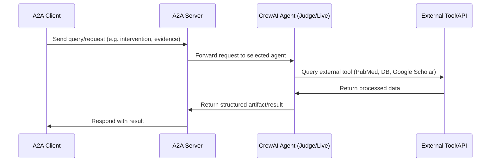

# System Architecture Diagram



# Live Agentic Database – A2A Server

This project implements a professional multi-agent system for biomedical queries, based on CrewAI and exposed via the A2A protocol. It enables tasks such as literature surveillance, genomic data extraction, intervention analysis, and hypothesis synthesis, integrating LLMs and external APIs.

## Project Structure

```
├── src/
│   ├── agent.py                # Agent definitions: Judge and Live Agent
│   ├── agent_executor.py       # Agent execution and orchestration
│   ├── main_judge-agent.py     # Entrypoint for Judge Agent
│   ├── main_live_agent.py      # Entrypoint for Intervention Agent
│   ├── tools.py                # Tools: PubMed, database, Google Scholar, etc.
│   └── __pycache__/            # Compiled files
├── user_personal_data.sql      # SQL script for personal data
├── pyproject.toml              # Python dependencies and config
├── Dockerfile                  # Base image for agents
├── docker-compose.yml          # Multi-service orchestration
├── uv.lock                     # Reproducible installs
├── .env                        # Environment variables (API keys, etc.)
├── README.md                   # Project documentation
```

## Agents

- **JudgeAgent**: Verifies the integrity and evidence of interventions, reviewing studies and personal data.
- **LiveAgent**: Answers questions about longevity interventions, citing studies and restricting responses to the database.

## Integrated Tools

- `pubmed_tool`: Search for scientific articles in PubMed.
- `google_scholar_tool`: Search in Google Scholar.
- `query_live_database`: SQL queries on the interventions database.
- `get_user_personal_data`: Access to user personal data.

## Installation and Usage

### Requirements

- Python 3.12
- [uv](https://docs.astral.sh/uv/) or pip
- Google API Key (Gemini) if using Google LLM

### Installation


```powershell
uv pip install -r pyproject.toml
# or
pip install -r requirements.txt
```

Set your variables in `.env`:

```powershell
echo "GOOGLE_API_KEY=your_api_key" > .env
```

### Local Execution

From the project root:

```powershell
python -m src.main_judge-agent
python -m src.main_live_agent
```

### Docker

To start all services:

```powershell
docker-compose --env-file .env up --build
```

To build and run a single agent:

```powershell
docker build -t live-agentic-server .
docker run -p 7000:7000 -e GOOGLE_API_KEY=your_api_key live-agentic-server python -m src.main_judge-agent --host 0.0.0.0 --port 7000
```

## Example Usage

1. Start the desired agent.
2. Send an A2A request to the corresponding endpoint.
3. The agent processes the query and returns structured results.

## Features

- Modular, professional Python architecture
- Multi-agent orchestration for biomedical research
- Integration with PubMed, Google Scholar, and custom database
- Docker and Docker Compose support
- Flexible configuration via environment variables

## Limitations

- No true streaming (CrewAI does not support it)
- Depends on public APIs (may have limits)
- Requires valid API keys for LLMs

## References

- [CrewAI](https://docs.crewai.com/introduction)
- [A2A Protocol](https://a2a-protocol.org)
- [Google Gemini API](https://ai.google.dev/gemini-api)
